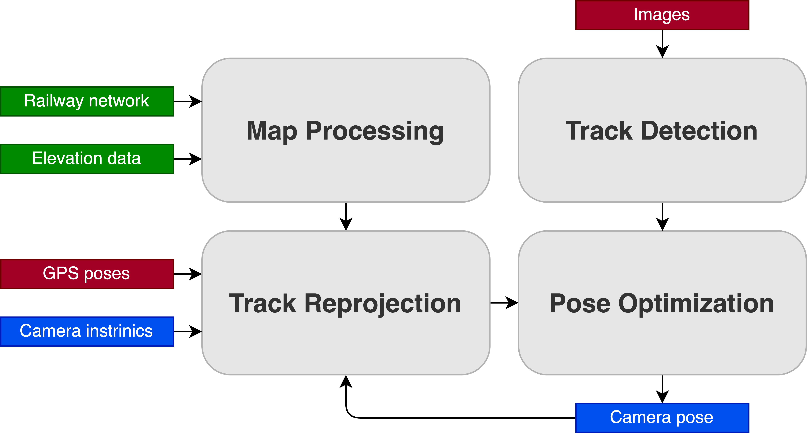
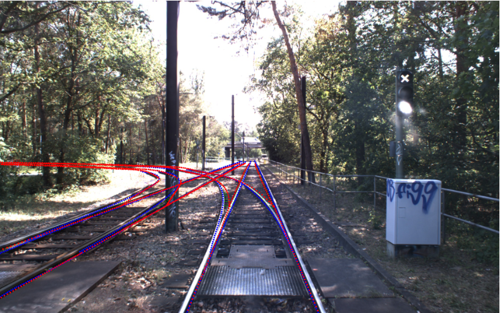

# Online Extrinsic Camera Calibration using Map Information

[](https://www.python.org/downloads/) [](https://en.wikipedia.org/wiki/C%2B%2B#Standardization)

**"Online Extrinsic Camera Calibration from Multiple Keyframes using Map Information"**

📄 [Report](Report.pdf) | 📊 [Presentation](Presentation.pdf)

This project implements an algorithm to compute the relative pose between a GPS sensor and an intrinsically-calibrated camera at the front of a track vehicle. The camera is mounted rigidly in an unknown location that is to be inferred from its images. To achieve this, map information is combined with detected railway tracks using an optimization approach based on iterative closest points (ICP) that leverages information across multiple frames.

> **Note:** The detection pipeline is not implemented; instead, annotations are used to simulate observed tracks.

> **Data accuracy and sensor fusion:** Multi-frame optimization is limited by the accuracy of the available data. To address this, sensor fusion via an Extended Kalman Filter (EKF) is used to combine GPS with IMU data for a more precise state estimate.

### Contents

1. [Pipeline Overview](#1-pipeline-overview)
2. [Installation](#2-installation)
3. [Data Preparation](#3-data-preparation)
4. [Usage](#4-usage)
5. [Implementation Details](#5-implementation-details)
6. [Evaluation & Further Work](#6-evaluation--further-work)
7. [Troubleshooting](#7-troubleshooting)
8. [Acknowledgments](#8-acknowledgments)


## 1. Pipeline Overview

### Components



- **Map Processing:** Processes raw map data (OpenStreetMap and elevation) into 3D point clouds for each railway track. This includes extracting nodes and tracks, converting them to 2D splines, filling gaps for regular spacing, and adding elevation data. The output is a set of 3D points for each track, optimized for downstream use.
- **Track Detection:** Observes visible railway tracks in each image, currently via manual annotation. Annotated points are converted to 2D splines and interpolated to increase point density, resulting in dense 2D points for each observed track.
- **Track Reprojection:** Reprojects local 3D railway points onto each image using the GPS pose, camera intrinsics, and current camera pose estimate. This involves finding local tracks, increasing point density, transforming points into the camera frame, filtering by angle, and projecting onto the image. The output is a set of regularly-spaced 2D points on the image.
- **Pose Optimization:** Optimizes the camera pose by minimizing the error between observed and reprojected tracks using an iterative closest point (ICP) algorithm. One-to-one correspondences are found, residuals are computed, and the optimization problem is solved to update the camera pose. This can be performed for single or multiple frames in parallel.

| **Track Detection** | **Track Reprojection** | **Pose Optimization** |
| - | - | - |
|  |  |  |

### Final Result

Below is an example of the final output visualization generated by the pipeline, showing the overlay of reprojected railway tracks and annotated points on a camera image. This demonstrates the successful alignment between the projected map data and the observed tracks after optimization.



## 2. Installation

### Python Environment
- Python 3.8+
- Install dependencies:
  ```bash
  pip install -r requirements.txt
  ```

### C++ Environment
- Pull the pybind11 submodule:
  ```bash
  git submodule update --init --recursive
  ```
- Install dependencies:
  - Eigen3, Ceres Solver, OpenCV, glog, gflags
  - Example (Ubuntu): `sudo apt install libeigen3-dev libceres-dev libopencv-dev`
- Compile the C++ code:
  ```bash
  cd src/cpp
  mkdir build
  cd build
  cmake ..
  ```
- **Automatic Pybind11 Compilation**: This process creates a CPython file that Python can access, in the same directory as the C++ file with the name `optimization.cpython.<cpython_version>.so`
  ```console
  cd src/cpp/build
  make
  make install
  ```

Now, when running the Python file (main.py), it should be able to access the C++ functions.

If cpp.optimization is not found by Python, make sure the Pybind11 compilation and the virtual environment are using the same Python versions. If there is another issue, it might be due to missing package dependencies.

#### Alternative: Manual Pybind11 Compilation

Make executable, include all dependencies (-I) in their directories and link (-l) the libraries.

The below command is for macOS. For Linux replace "-undefined dynamic_lookup" with "-fPIC". The command assumes the Eigen3, glog, gflags, pybind11 and Python3.9 header files are located in the /usr/local/include/ directory. If this is not the case, specify the correct paths after each -I flag.

```console
cd src/cpp

g++ -std=c++17 -I/usr/local/include/eigen3/ -I/usr/local/include/glog/ -I/usr/local/include/gflags/ -I/usr/local/include/pybind11/ -I/usr/local/include/python3.9 -o optimization -undefined dynamic_lookup $(python3-config --includes) optimization.cc -o optimization$(python3-config --extension-suffix) -lceres
```

More info and/or troubleshooting: <https://pybind11.readthedocs.io/en/latest/compiling.html#building-manually>

## 3. Data Preparation

Store the relevant input data locally and specify the paths in [data.py](src/data.py). The structure uses `path_to_data` as the root directory, which contains the subdirectories `map`, `elevation`, and `frames`.

**Directory Structure:**

```text
path_to_data/
├── map/
│   └── <osm_file.osm>
├── elevation/
│   └── <elevation_data.xyz>
└── frames/
    ├── images/         # Images for each camera are stored in subdirectories, e.g. images/cam0/, images/cam1/
    ├── poses/
    └── annotations/    # Annotations for each camera are stored in subdirectories, e.g. annotations/cam0/, annotations/cam1/
```

**Railway Map (OSM)**
- Store the relevant OSM file locally (e.g. in the `map` subdirectory) and specify `path_to_osm_file` in [data.py](src/data.py).

**Elevation**
- Elevation data is obtained automatically when running the pipeline, which calls the method `MapInfo.get_elevation(x_gps, y_gps)` in [map_info.py](src/map_info.py). The data is downloaded from the website <https://data.geobasis-bb.de/geobasis/daten/dgm/xyz/> and stored as local files under the specified path `path_to_elevation_data` (e.g. the 'elevation' subdirectory).

**Frames**
- Each frame contains synchronous data from a stereo camera setup and various sensors, where the same frame corresponds to the same filename (i.e. number 000000):
  - Images for each camera (JPG files)
  - Poses from RTK-GPS (YAML files)
- To avoid having to use ROS directly to be able to interact with the original ROS Bags containing the recorded information, the file [bag_data.py](src/bag_data.py) can be used to directly read ROS messages from relevant topics at indicated timestamps and export them. The idea here is to annotate a selection of images and use their timestamps to export the full information (synchronized pose and stereo image) for each.

**Annotations**
- Annotations are created manually using the tool <https://www.robots.ox.ac.uk/~vgg/software/via/>, by uploading the relevant images and drawing each railway track as a sequence of points. The annotations can be exported as a CSV file, which are read by the `Annotation` class in [annotation.py](src/annotation.py). Finally, specify `path_to_annotations` in [data.py](src/data.py).

## 4. Usage

### Quick Start

1. **Set up data paths**: Edit `src/data.py` to specify the locations of your map, elevation, frame, and annotation data.
2. **Install dependencies**: `pip install -r requirements.txt` (see above for C++).
3. **Build the C++ module**:
   ```bash
   cd src/cpp
   mkdir -p build && cd build
   cmake .. && make && make install
   ```
4. **Run the main pipeline**: `python src/main.py`

The main pipeline (main.py) is the core of the project and comprises the following steps:
1. Set up camera objects and initial pose
2. Create/load Railway object from frames
3. Visualize railway and frame data (optional)
4. Create keyframes for optimization
5. Visualize initial reprojections (before optimization)
6. Optimize camera poses using C++ backend
7. Compute and print stereo camera transformation & accuracy
8. Visualize final reprojections (after optimization)

You can interact with the pipeline and adjust parameters in `main.py` for experiments or evaluation.

## 5. Implementation Details

### File Structure & Modules

This project is organized in a modular way, with each file or class responsible for a specific part of the pipeline. Below, each main component is described with its role and usage in the overall workflow.

**Main Pipeline**
- **[main.py](src/main.py)**: The entry point of the pipeline. This script orchestrates the entire process: it sets up the camera objects with their intrinsics and initial pose, creates the Railway object from map and frame data, visualizes the railway and frame data, creates keyframes, and runs the optimization routine. It is also the place to adjust parameters and interact with the pipeline for experiments or evaluation.

**Data Handling**
- **[data.py](src/data.py)**: This file specifies all data locations and constants used throughout the project. It defines the paths to map, elevation, frame, and annotation data, as well as known parameters such as track width. It ensures that the required directory structure exists and is the central place to configure data sources for the pipeline.
- **[bag_data.py](src/bag_data.py)**: Handles the conversion of original ROS bag data into frames that can be used as inputs for the pipeline. It reads synchronized sensor data (images, GPS, IMU) from ROS bags and exports them in a format suitable for further processing and annotation.

**Map Processing**
- **[railway.py](src/railway.py)**: Implements the processing of raw map data (OSM and elevation) into 3D point clouds for each railway track. It takes a sequence of frames as input, extracts nodes and tracks, fills gaps, and adds elevation data. The resulting Railway object is saved for reuse, avoiding repeated processing.
- **[import_osm.py](src/import_osm.py)**: Handles the parsing and extraction of relevant information from OpenStreetMap (OSM) files. It is used internally by railway.py to obtain the railway network structure.
- **[map_info.py](src/map_info.py)**: Provides methods to retrieve additional map information, such as elevation at specific GPS coordinates. It is used by other components to enrich frame and railway data with elevation and other map-based attributes.

**Keyframes & Annotations**
- **[keyframe.py](src/keyframe.py)**: Defines the Frame and Keyframe classes. A Frame contains basic information (ID, GPS data) and is used for dense mapping, while a Keyframe is a more sophisticated object containing images, associated cameras, GPS, and annotations. Keyframes are used for optimization and evaluation.
- **[gps.py](src/gps.py)**: Implements the GPS class, which is part of each Frame/Keyframe. It processes GPS sensor readings, computes local positions and rotations, and retrieves elevation data via MapInfo.
- **[annotation.py](src/annotation.py)**: Handles the Annotation class, which is part of each Keyframe. It loads manual annotations from CSV files, processes them into 2D splines, and provides methods for visualization and further processing.

**Transformations & Visualization**
- **[camera.py](src/camera.py)**: Defines the Camera class, which encapsulates camera intrinsics, pose, undistortion, and projection methods. It provides the necessary tools for transforming and projecting 3D points into image space, and for handling camera-specific operations throughout the pipeline.
- **[transformation.py](src/transformation.py)**: Contains the Transformation class, which provides static methods for working with homogeneous transformations, rotation representations, coordinate frame conversions, and spline interpolation. It is used by many other components for geometric computations.
- **[visualization.py](src/visualization.py)**: Provides utilities for visualizing results, including overlays of reprojected tracks, depth maps, and scene coordinates. It is used for both debugging and evaluation of the pipeline's outputs.

### C++ Integration

**[src/cpp/](src/cpp/)**
This directory contains the C++ code for optimization, implemented using Ceres Solver for efficiency. The C++ routines handle the core optimization steps (e.g., iterative closest point, cost function evaluation) and are exposed to Python via Pybind11. The main functions available to Python are `add_keyframe` (to add keyframe data for optimization), `reset_keyframes` (to reset the keyframe list for a new camera), and `update_camera_pose` (to run the optimization and return the updated camera pose). This integration allows the pipeline to combine Python's flexibility with C++'s computational performance.

## 6. Evaluation & Further Work

### Limitations & Future Work

- **Multi-frame optimization** is limited by the accuracy of the available data. Improving data quality or using more advanced sensor fusion could further enhance results.
- **Sensor fusion** via EKF is used to combine GPS and IMU, but further improvements or alternative fusion strategies could be explored.
- The detection pipeline is not implemented; manual annotation is used for track detection. Integrating an automated detection pipeline would make the system more robust and scalable.
- Additional evaluation and testing on more diverse datasets would help generalize the approach.

### Testing

Correctness is primarily verified through visualization of outputs (e.g., overlays, depth maps) and runtime assertions. Traditional unit tests are not included, as outputs are best evaluated visually.

## 7. Troubleshooting

- **C++ module not found:** Ensure Pybind11 compilation and Python environment match.
- **Missing dependencies:** Double-check all required libraries are installed.
- **Data format issues:** Verify directory structure and file formats as described above.

## 8. Acknowledgments

- [VGG VIA](https://www.robots.ox.ac.uk/~vgg/software/via/) for annotation tool
- [Eigen3](http://eigen.tuxfamily.org/), [Ceres Solver](http://ceres-solver.org/), [OpenCV](https://opencv.org/), [glog](https://github.com/google/glog), [gflags](https://gflags.github.io/gflags/)
- [pybind11](https://github.com/pybind/pybind11) for Python/C++ bindings
